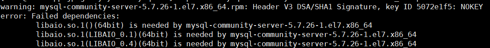

# 搭建javaEE环境

#### 一、概述

1. 如果我们要在Linux下进行JAVAEE开发，我们需要安装如下软件
   - ideaIU-2020.2.3.tar.gz
   - apache-tomcat-8.5.59.tar.gz
   - mysql-5.7.26-1.el7.x86_64.rpm-bundl...
   - jdk-8u261-linux-x64.tar.gz
   - Centos-7-x86_64-DVD-1810.iso

#### 二、安装步骤-安装JDK

1. mkdir /opt/jdk
2. 通过xftp6上传到/opt/jdk下
3. cd /opt/jdk
4. 解压 tar - zxvf jdk-8u261-linux-x64.tar.gz
5. mkdir /usr/local/java
6. mv /opt/jdk/jdk1.8.0_261 /usr/local/java
7. 配置环境变量的配置文件vim /etc/profile
8. export JAVA_HOME=/usr/local/java/jdk1.8.0_261
9. export PATH=$JAVA_HOME/bin:$PATH
10. source /etc/profile [让文件生效]
11. 测试是否安装成功
    - 编写一个简单的java程序，输出“hello world！”  

#### 三、安装tomcat

1. 上传安装文件，并解压缩到/opt/tomcat
2. 进入解压目录/bin，启动tomcat --（./startup.sh）
3. 开放端口8080
   - firewall-cmd  --permanent --add-port=8080/tcp
4. 测试安装是否成功
   - 在windows，linux下访问http://linuxip:8080

#### 四、安装idea2020

1. 去idea官网下载idea的linux发行版本，然后传到linux上解压到/opt/idea即可
2. 启动idea bin目录下 ./idea.sh，配置jdk
3. 编写Hello，world程序测试

#### 五、mysql5.7的安装

1. 新建/opt/mysql5.7,并cd进去
2. 运行 wget http://dev.mysql.com/get/mysql-5.7.26-1.el7.x86_64.rpm-bundle.tar，下载mysql安装包
3. centos7.6自带的类mysql数据库是mariadb，会跟mysql冲突，先删除
4. 运行tar -zxvf mysql-5.7.26-1.el7.x86_64.rpm-bundle.tar
5. 运行rpm -qa|grep mari，查询mariadb相关安装包
6. 运行rpm -e --nodeps mariadb-libs，卸载
7. 然后开始真正安装mysql，依次运行以下命令
   - rpm -ivh mysql-community-common-5.7.26-1.el7.x86_64.rpm
   - rpm -ivh mysql-community-libs-5.7.26-1.el7.x86_64.rpm
   - rpm -ivh mysql-community-client-5.7.26-1.el7.x86_64.rpm
   - rpm -ivh mysql-community-server-5.7.26-1.el7.x86_64.rpm
     - 如果出现以下错误
     - 
     - 那么运行命令 yum install libaio
8. 运行systemctl start mysqld.service，启动mysql
9. 开始设置mysql密码
10. mysql自动给root用户设置随机密码，运行grep "password" /var/log/mysqld.log可看到当前密码
11. 运行mysql -u root -p，用于root用户登录，提示输入密码可s用上述的，可以成功登录进入mysql命令行。
12. 设置root 密码，对于个人开发环境，如果要设置比较简单的密码（生产环境要设置复杂的密码），可以运行set global validate_password_policy=0,提示密码设置策略（默认为1）
13. set password for 'root'@'localhost'=password('mj20020519');
14. 运行flush privileges；使密码设置生效。