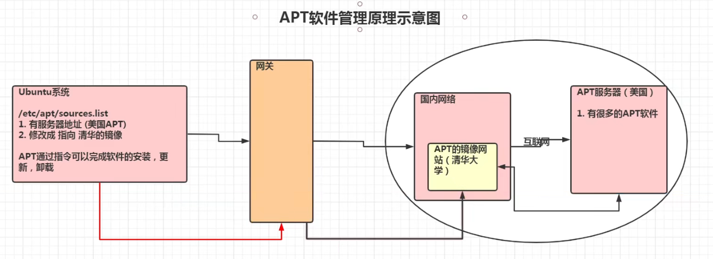
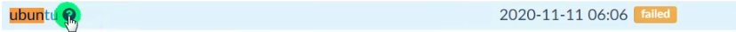

# Ubuntu


#### 一、Ubuntu的root用户

1. 切换到root用户
   - su root
2. 普通用户使用root权限
   - sudo 指令
3. 给root用户设置初始密码并使用
   - sudo password，输入一般用户密码并设定root用户密码
   - 输入exit命令，退出root用户，进入普通用户

#### 二、APT软件管理

1. apt介绍

   - apt是Advanced Packaging Tool的简称，是一款安装包管理工具。在Ubuntu下，我们可以使用apt命令进行软件包的安装，删除，清理等，类似于Windows中的软件管理工具。
   - 

2. Ubuntu软件操作的相关指令

   - ```
     sudo apt-get update 更新源
     sudo apt-get install package 安装包
     sudo apt-get remove package 删除包
     
     sudo apt-cache search package 搜索软件包
     sudo apt-cache show package 获取包的相关信息，如说明，大小，版本等
     sudo apt-cache install package --reinstall 重新安装软件包
     
     sudo apt-get -f install 修复安装
     sudo apt-get remove package --purge 删除包，包括配置文件等
     sudo apt-get build-dep package 安装相关的编译环境
     
     sudo apt-get upgrade 更新已安装包
     sudo apt-get dist-upgrade 升级系统
     sudo apt-cache depends package 了解使用该包依赖那些包
     sudo apt-cache rdepends package 查看该包被哪些包依赖
     sudo apt-get source package 下载该包的源代码
     ```

3. 更新Ubuntu软件下载地址

   - 寻找国内镜像
   - 在清华大学开源软件镜像站找Ubuntu的镜像
   - https://mirrors.tuna.tsinghua.edu.cn/
   - 
   - 先备份Ubuntu默认的源地址
   - sudo cp /etc/apt/sources.list /etc/apt/sources.list.bak
   - 清空sources.list 文件复制镜像网站的地址
   - echo '' > sources.list
   - 然后 vi /etc/apt/sources.list ，将镜像中的Ubuntu镜像复制到里面。
   - 然后更新源地址 sudo apt-get update

4. 集群

   - 基本语法：
     - ssh 用户名@IP
     - 例如ssh mj@192.168.58.2
   - 使用ssh访问出错，可查看是否有~/.ssh/known_ssh 尝试删除改文件即可
   - 登出，使用logout或exit