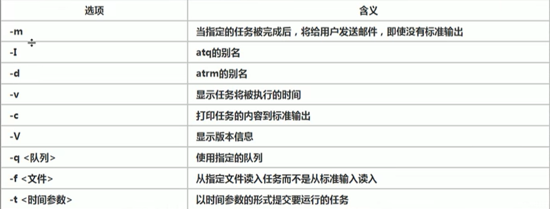

# 定时任务调度


#### 一、crond任务调度

1. crontab进行定时任务的设置

2. 概述

   - 任务调度：是指系统在某个时间执行的特定的命令或者程序。
   - 任务调度分类：
     - 系统工作：有些重要的工作必须周而复始的执行，如病毒扫描等。
     - 个别用户工作：个别用户可能希望执行某些程序，比如对mysql数据库的备份。

3. 基本语法

   - crontab [选项]
   - 

4. 快速入门

   - 设置任务调度文件：/etc/crontab

   - 设置个人任务调度：执行crontab -e 命令

   - 接着输入任务到调度文件

   - 如：“*/1****”ls -l /etc/ > /tmp/to.txt --每小时的每分钟执行ls -l /etc/ > /tmp/to.txt命令

   - 

   - ```
     crontab -e
     */1 * * * * ls -l /etc/ > /tmp/to.txt --*和*之间有空格
     ```

5. 特殊符号说明

   - 

6. 特定时间执行任务案例

   - 

7. 应用实例

   - 每隔1分钟，就将当前的日期信息，追加到/tmp/mydate文件中。

     - */1 * * * * date >> /tmp/mydate

   - 每隔1分钟，将当前日期和日历都追加到/home/mycal文件中。

     - vim my.sh

       ```sh
       date >> /home/mycal
       cal >> /home/mycal
       ```

     - chmod u+x my.sh

     - crontab -e

     - */1 * * * * /home/my.sh

   - 每天凌晨2:00将mysql数据库testdb，备份到文件中。

     - crontab -e
     - 0 2 * * *  mysqldump -u root -p 密码 testdb > /home/db.bak

   - crond 相关指令：

     - crontab -r:终止任务调度
     - crontab -l:列出当前有哪些任务调度
     - service crond restart:重启任务调度


#### 二、at定时任务

1. 基本介绍
   - at命令是一次性定时计划任务，at的守护进程atd会以后台模式运行，检查口作业队列来运行。
   - 默认情况下，atd守护进程每60秒检查一次作业队列，有作业时，会检查作业的运行时间，如果时间与当前时间匹配，那么就运行此作业。
   - at命令是一次性定时计划任务，执行完一个任务后不在执行此任务了。
   - 在使用at命令时，一定要检查atd进程的运行情况，可以用指令来查看。
     - ps -ef | grep atd --可以检测atd是否在运行
2. at命令格式
   - at [选项] [时间]
   - ctrl+D 结束at命令的输入
   - 
3. at时间定义
   - at指定时间的方法
     - 接受在当天的hh:mm（小时:分钟）式的时间指定，假如该时间已过去，那么就放在第二天执行。
     - 使用midnight（深夜），noon（中午），teatime（饮茶时间，一般是下午四点）等比较模糊的词语来指定时间。
     - 采用12小时计时制，即在时间后面加上AM（上午）或PM（下午）来说明是上午还是下午。例如，12pm
     - 指定命令执行的具体日期，指定格式为month day（月 日）或mm/dd/yy（月/日/年）或dd.mm.yy（日.月.年），指定的日期必须跟在指定的时间的后面，例如 04:00 2021-03-1
     - 使用相对计时法，指定格式为：now+count time-units，now就是当前时间，time-units是时间单位，这里能够是minutes（分钟），hours（小时），days（天），weeks（星期），count是时间的数量，几天，几小时。例如now + 5 minutes --5分钟以后执行命令
     - 直接使用today（今天），tomorrow（明天）来指定完成命令的时间。
   - 实例
     - 两天后的下午五点执行 /bin/ls /home
       - at 5pm  + 2 days 
       - at > /bin/ls /home
     - atq命令来查看系统中没有执行的工作内容
       - atq
     - 明天17点钟，输出时间到指定文件内 比如 /root/date100.log
       - at 5pm tomorrow
       - at > date > /root/date100.log
     - 2分钟后，输出时间到指定文件内， 比如/root/date200.log
       - at now + 2 minutes
       - at > date > /root/date200.log
     - 删除已经设置的任务，at rm 编号
       - at rm 5 --删除5号任务