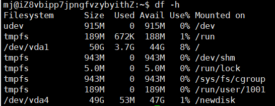

# 磁盘情况查询

#### 一、查询系统整体磁盘使用情况

1. 基本语法：df -h
   - 
2. 查询指定目录的磁盘占用情况，默认为当前目录
   - du -h /目录
   - -s 指定目录占用大小汇总
   - -h 带计量单位
   - -a 含文件
   - --max-depth=1 子目录深度
   - -c列出明细的同时，增加汇总值
   - 查询opt目录的磁盘占用情况，深度为1。 du -h --max-depth=1 /opt -h M