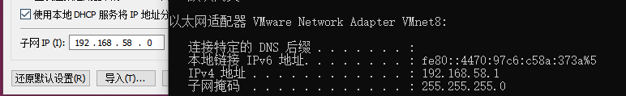

# 网络配置

#### 一、linux网络配置原理图

1. 原理图
   - 

#### 二、查看网络IP和网关

1. 查看虚拟网络编辑器和修改IP地址
   - 在虚拟机中点击编辑，选择虚拟网络编辑器，可以看到如下页面
   - 
     - 对于子网IP和NAT的设置就在这个界面进行。
   - 子网IP和windows中的VMnet8中的ipv4地址对应
     - 
2. 在windows中查看网络配置
   - ipconfig指令
3. 在linux下查看网络配置
   - ifconfig指令
4. ping测试主机之间网络连通性
   - ping目的主机--此时当前服务器是否可以连接目的主机

#### 三、linux网络环境配置

1. 第一种方法（自动获取）：
   - 登录后，通过界面来设置自动获取ip，特点：linux启动后会自动获取ip，缺点是每次自动获取的ip地址可能不一样。
   - 这种方法不适合用于服务器。
   - 
   - 在设置里面，网络，设置，然后选择ipv4，就可以选择自动获取ip
2. 第二种方法（指定ip）
   - 直接修改配置文件来指定ip，并可以连接到外网，编辑 vi /etc/sysconfig/network-scripts/ifcfg-ens33，然后将ip设置为静态的。
   - ifcfg-ens33文件说明：
     - DEVICE=eth0 #接口名（设备，网卡）
     - HWADDR=00:0C:2x:6x:0x:xx #MAC地址
     - TYPE=Ethernet #网络类型（通常是Ethemet）
     - UUID=....#随机id
     - #系统启动时网络接口是否有效（yes/no）
     - ONBOOT=yes
     - #IP的配置方法[none]|static|bootp|dhcp]（引导时不使用协议|静态分配IP|BOOTP协议|DHCP协议）
     - BOOTPROTO=static
     - #IP地址
     - IPADDR = 192.168.200.130
     - #网关
     - GATEWAY = 192.168.200.2
     - #域名解析器
     - DNS1=192.168.200.2
   - 重启网络服务或者重启系统生效。
     - service network restart；reboot