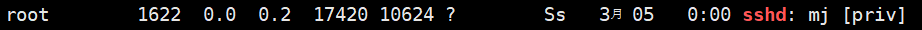
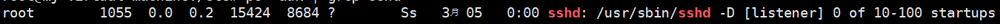
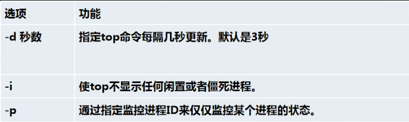
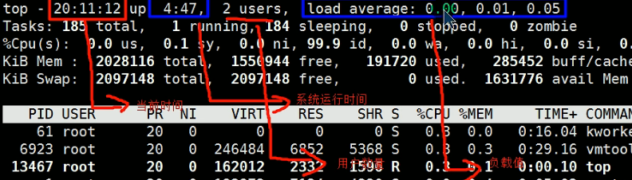
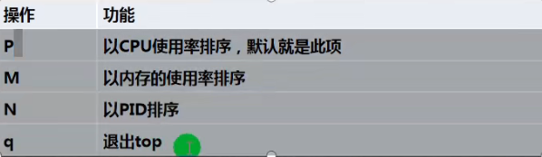

# 进程管理

#### 一、进程的基本介绍

1. 在LINUX中，每个执行的程序都称为一个进程，每一个进程都分配一个ID号（pid，进程号）。
2. 每个进程都可能以两种方式存在。前台与后台，所谓前台进程就是用户目前的屏幕上可以进行操作的。后台进程就是实际在操作，但由于屏幕上无法看到的进程，通常使用后台方式执行。
3. 一般系统的服务都是以后台进程的方式存在，而且都会常驻在系统中，知道关机才结束。

#### 二、ps指令详解

1. 基本介绍
   - ps命令是用来查看目前系统中，有哪些正在执行，以及它们的执行情况，可以不加任何参数。
   - ps显示的信息选项：
     - PID：进程识别号
     - TTY：终端机号
     - TIME：此进程占用的CPU时间
     - CMD：正在执行的命令或进程名
     - CPU：当前进程占用CPU的百分比
     - %MEM：占用物理内存的百分比
     - VSZ：占用虚拟内存的大小（KB）
     - RSS：占用的物理内存的大小（KB）
     - STAT：当前运行状态，S正在休眠，R正在运行，s表示该进程是会话的先导进程，N表示进程拥有比普通优先级更低的优先级，D表示短期等待，Z表示僵尸进程，T表示被跟踪或被停止等。
     - STATR：执行的开始时间
     - COMMAND：执行该进程的指令
   - ps -a：显示当前终端的所有进程信息
   - ps -u：以用户的格式显示进程信息
   - ps -x：显示后台进程运行的参数

#### 三、父子进程

1. ps -ef是以全格式显示当前所有的进程。
   - -e显示所有进程，-f 全格式
2. ps -ef | grep xxx
3. 是BSD风格
4. UID：用户ID
5. PID：进程ID
6. PPID：父进程ID
7. C：CPU用于计算执行优先级的因子，数值越大，表明进程是CPU密集型运算，执行优先级会降低；数值越小，表明进程是I/O密集型运算，执行优先级会提高。
8. STIME：进程的启动时间
9. TTY：完整的终端名称
10. CMD：启动进程所需要的时间

#### 四、终止进程

1. 终止进程kill和killall
2. 介绍：若是某个进行执行一半需要停止时，或是已消了很大的系统资源时，此时可以考虑停止该进程，使用kill命令来完成此项任务。
3. 基本语法
   - kill 选项 进程号 --通过进程号杀死进程
   - killall 进程名称 --通过进程名杀死进程，也支持通配符，这在系统因负载过大而变得很慢时很有用。
4. 常用选项：
   - -9：表示强迫进程立即停止
5. 案例
   - 踢掉某个非法登录用户
     - ps -aux | grep sshd
     - kill 用户登录的进程号
     - 
   - 终止远程登录服务sshd，在适当时候再次重启sshd服务
     - ps -aux | grep sshd --找到sshd服务的进程号
     - 
     - /bin/systemctl start sshd.service --重启sshd服务
   - 终止多个gedit
     - killall gedit
   - 强制杀掉一个终端
     - ps -aux | grep bash
     - kill -9 bash 终端进程号

#### 五、pstree指令

1. 查看进程树pstree
2. 基本语法：
   - pstree 选项 --可以更直观的来看进程信息
3. 常用选项
   - -p：显示进程的PID
   - -u：显示进程的所属用户
4. 实例
   - 请以树状的形式显示进程的pid ---pstree -p
   - 请以树状的形式显示进程的用户id  ---pstree -u

#### 六、服务管理

1. 介绍：服务（service）本质就是进程，但是是运行在后台的，通常都会监听某个端口，等待其它程序的请求，比如（mysql，sshd，防火墙等），因此我们又称为守护进程，是linux中非常重要的点。
2. service管理指令：
   - service 服务名 [start | stop | restart | reload | status]（reload重载）
   - 在centos7.0以后，很多服务器不再使用service，而是systemctl
   - service指令管理的服务在/etc/init.d查看
3. service管理指令案例：
   - 请使用service指令，查看，关闭，启动network[注意：在虚拟系统中演示，因为网络连接会关闭]
4. 查看服务名
   - 输入setup 可以看所有的服务（Centos）
   - tab可以选择，可以选择退出键来退出
5. 服务的运行级别（runlevel）
   - Linux系统有7种运行级别（runlevel）：常用的是级别3和5
   - 运行级别0：系统停机状态，系统默认运行级别不能设为0，否则不能正常启动。
   - 运行级别1：单用户工作状态，root权限，用于系统维护，禁止远程登录
   - 运行级别2：多用户状态（没有NFS），不支持网络
   - 运行级别3：完全的多用户状态（有NFS），登录后进入控制台命令行模式。
   - 运行级别4：系统未使用，保留
   - 运行级别5：X11控制台，登录后进入图形GUI模式
   - 运行级别6：系统正常关闭并重启，默认运行级别不能设为6，否则不能正常启动。
   - 开机的流程说明：
     - 
6. CentOS7后运行级别说明
   - 在/etc/initab进行了简化，如下：
   - multi-user.target: analogous to runlevel 3（多用户级别）。
   - graphical.target: analogous to runlevel 5（图形界面）。
   - 可以通过systemctl get-default来查看当前默认的运行级别。
   - 可以通过systemctl set-default TARGET.target来设置默认运行级别。
7. chkconfig指令
   - 通过chkconfig指令可以给服务的各个运行级别设置自 启动/关闭
   - chkconfig指令管理的服务在/etc/init.d查看
   - 注意：Centos7.0后，很多服务用systemctl管理
   - 基本语法：
     - 查看服务 chkconfig --list | grep xxx
     - chkconfig 服务名 --list
     - chkconfig --level 5 服务名 on/off
   - 对network服务，进行各种操作，把network在3运行级别，关闭自启动
     - chkconfig --level 3 network off
     - chkconfig --level 3 network on
8. systemctl指令
   - 基本语法：
      - systemctl [start|stop|restart|status] 服务名
      - systemctl指令管理的服务在/usr/lib/systemd/system查看
   - systemctl设置服务的自启动状态
      - systemctl list-unit-files [| grep 服务名]（查看服务开机启动状态，grep可以进行过滤）
      - systemctl enable 服务名（设置服务开机启动）(永久)
      - systemctl disable 服务名（关闭服务开机启动）（永久）
      - systemctl is-enable 服务名（查询某个服务是否是自启动的）
   - 案例：
      - 查看当前防火墙的状况，关闭防火墙和重启防火墙
      - filewalld--防火墙服务名称
      - systemctl list-unit-files
      - systemctl status firewalld
      - systemctl stop firewalld
   - 关闭或启用防火墙后，立即生效。
   - 这种方式只是临时生效，当重启系统后（还是回归以前对服务的设置）
   - 如果希望设置某个服务自启动或关闭永久生效，要使用systemctl [enable|disable] 服务名 
9. 打开或关闭指定端口
   - firewall指令
      - 打开端口：firewall-cmd --permanent --add-port=端口号/协议
      - 关闭端口：firewall-cmd --permanent --remove-port=端口号/协议
      - 重新载入，才能生效：firewall-cmd --reload
      - 查询端口是否开放：firewall-cmd --query-port=端口/协议

#### 七、动态监控进程

1. top与ps命令很相似，它们都用来显示正在执行的进程。Top和ps最大的不同之处在于top在执行一段时间可以更新正在运行的进程。
2. 基本语法：
   - top 选项
   - 
   - ​                               
3. 交互操作说明
   - 
4. 实例
   - 监控特定用户
     - top，回车
     - 输入u回车，在输入用户名
   - 终止指定进程
     - top，回车
     - k：然后输入“k”回车，再输入要结束的进程ID号

#### 八、监控网络状态

1. 查看系统网络情况netstat
2. 基本语法：
   - netstat 选项
   - -an：按一定顺序排列输出
   - -p：显示哪个进程在调用
3. 案例：请查看服务名为sshd的服务的信息
   - netstat -anp | gerp sshd
4. 检测主机连接命令ping：是一种网络连接工具