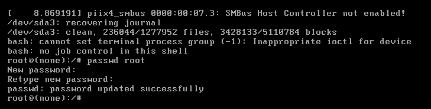

# 找回root密码

#### 一、Ubuntu系统

​	1、首先重启Ubuntu系统，然后快速按下shift键，以调出grub启动菜单。

​	2、然后选择第二个（Ubuntu高级选项），选中后按下enter键。

​		     

​	3、在新的页面中，选择最高的Linux内核版本所对应的recovery mode模式，即系统和密码恢复模式。之后，按下在键盘中按下e进入编辑。

​		     

​	4、按e编辑Grub的启动提示符把ro后面改为 quiet splash rw init=/bin/bash。

​             

​	5、修改完后，按ctrl+x或者F10启动系统。启动系统之后，直接就是root用户身份在执行命令了，然后输入passwd root更改密码即可。

​           

#### 二、Centos7

​	1、同样的在开机前按shfit，然后选择第一个，输入e进入编辑状态。

​	    

​	2、往下找到linux16，在末尾加上init=/bin/sh

​		

​	3、然后按下ctrl+X进入单用户模式，然后在光标闪烁的位置输入，mount -o remount,rw / 然后按下回车。然后输入passwd，回车，然后开始输入密码。

​	4、成功以后又会出现一个闪烁状态，然后输入：touch / .autorelabel（touch和/后都有一个空格），然后回车。

​	5、继续在光标闪烁的位置输入: exec / sbin/init （exec后有空格），时间可能较长，成功后系统会自动重启。