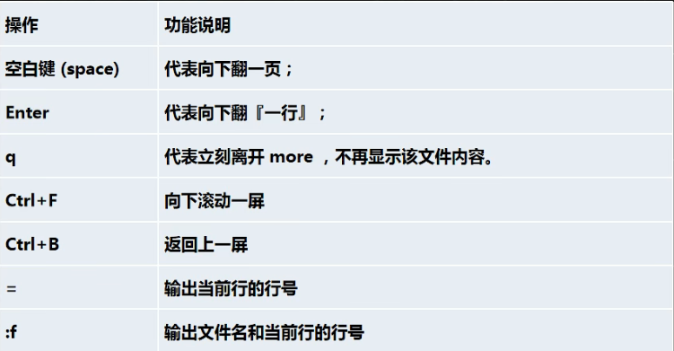
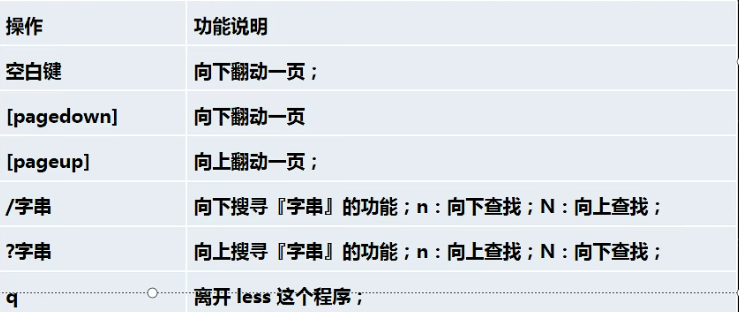

# 文件目录指令

#### 一、文件目录类

1. **pwd**指令：显示当前工作目录的绝对路径

   - 基本语法：pwd  

2. **ls**指令：

   - 基本语法：ls  选项--文件或是目录。
   - 常用选项：-a：显示当前目录所有的文件和目录，包括隐藏的。
   - -l：以列表的方式显示信息。
   - ls -lh：文件大小显示单位自动转化。

3. **cd**指令：切换到指定目录

   - 基本语法：cd [参数]。
   - cd ~或者cd：回到自己的家目录。
   - cd ..：回到当前目录的上一级目录。

4. **mkdir**指令：用于创建目录

   - 基本语法：mkdir 目录名
   - -p：创建多级目录  mkdir -p /you/me/are

5. **rmdir**指令：删除空目录：rmdir 目录名

   - 如果有内容，要是用rm -rf 目录名。

6. **touch**指令：创建空文件

   - 基本语法：touch 文件名称。

7. **cp**指令：cp指令拷贝文件到指定目录

   - 基本语法：cp  source dest
   - -r：递归复制整个文件夹。
   - 将home下的hello.txt文件拷贝到home下的bbb文件夹中。cp hello.txt bbb/。
   - 递归复制整个文件夹：将home下的bbb文件夹拷贝到opt文件夹下。cp -r /home/bbb/ /opt/。/cp -r /home/bbb/ /opt/（强制覆盖，不会提醒是否需要覆盖新的内容）。

8. **rm**指令：rm指令移除文件或目录

   - 基本语法：rm 要删除的文件或目录。
   - -r：递归强制删除整个文件夹。
   - -f：强制删除不提示。

9. **mv**指令：移动文件与目录或者重命名

   - 基本语法：mv oldNameFile newNameFile（重命名）mv /temp/movefile /targetFolder（移动文件）
   - 将/home/cat.txt文件重新命名为pig.txt。mv cat.txt pig.txt
   - 将/home/pig.txt文件移动到/root目录下 mv pig.txt /root/
   - 移动整个目录：mv /opt/bbb/ /home/

10. **cat**指令：查看文件内容

    - 基本语法：cat 要查看的文件名
    - -n：显示行号。
    - 查看/etc/profile文件内容，并显示行号。cat /etc/profile -n
    - cat只能浏览文件，而不能修改文件，为了浏览方便，一般会带上管道命令 | more

11. **more**指令：more指令是一个基于vi编辑器的文本过滤器，它以全屏幕的方式按页显示文本文件的内容，more指令中内置了若干快捷键（交互的指令）。

    - 基本语法：more 要查看的文件
    - 

12. **less**指令：less指令是用来分屏查看文件内容，它的功能和more指令相似，但是比more指令更加强大，支持各种显示终端，less指令在显示文件内容时，并不是一次将整个文件加载之后才显示，而是根据显示需要加载内容，对于显示大型文件具有较高的效率。

    - 基本语法：less 要查看的文件
    - 

13. **echo**指令：echo输出内容到控制台

    - 基本语法：echo 选项。
    - 使用echo输出环境变量，$PATH $HOSTNAME。echo $PATH
    - 使用echo输出hello，world！。echo "hello world"

14. **head**指令：head用于显示文件的开头部分，默认情况下head指令显示文件的前10行内容。

    - 基本语法：head 文件
    - head -n 5 文件 ---显示文件前5行内容。

15. **tail**指令：tail用于输出文件尾部的内容，默认情况下tail指令显示文件的尾10行内容。

    - 基本语法：tail 文件。
    - tail -n 5 文件 ---查看文件尾5行内容。
    - tail -f 文件 ---实时追踪该文档所有更新。

16. “>>”指令和">"指令：追加和输出重定向

    - 基本语法：ls -l > 文件  --列表的内容覆盖写入到文件中
    - ls -al >> 文件 --列表的内容追加到文件末尾
    - cat 文件1 > 文件2 ---将文件1的内容覆盖到文件2
    - echo "内容" >> 文件 --将内容追加到文件的末尾

17. **ln**指令：软链接也叫符号链接，类似于windows里的快捷方式，主要存放了链接其他文件的路径。

    - 基本语法：ln -s 原文件或目录 软链接名 （给原文件创建一个软链接）。
    - 在/home目录下创建一个软链接myroot，连接到/root目录。ln -s /root/ myroot
    - 删除软链接myroot。rm /home/myroot（myroot所在目录路径）

18. **history**指令：查看已经执行过历史命令，也可以执行历史命令。

    - 基本语法：history
    - 最近10个执行过的指令：history 10
    - 执行历史编号为5的指令：!5

    