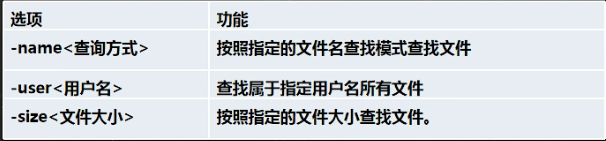
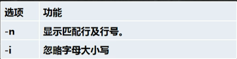

# 查找指令

#### 一、搜索查找类

1. **find**指令：find将从指定目录向下递归的遍历各个子目录，将满足条件的文件或者目录显示在终端
   - find 搜索范围 选项
   - 
   - 按文件名查找。find /home -name hello.txt
   - 按拥有者。  find /home -user mj
   - 按文件大小。 find /home -size -200   ---小于200(+n大于，-n小于，n就等于)（单位有K，M，G）
2. **locate**指令：locate指令可以快速定位文件路径，locate指令利用事先建立的系统中所有文件名称及路径的locate数据库实现快速定位给定的文件，locate指令无需遍历整个文件系统，查询速度比较快，为了保证查询结果的准确性，管理员必须定期更新locate时刻。
   - locate 搜索文件
   - 由于locate指令基于数据库进行查询，所以第一次运行前，必须使用locate指令创建locate数据库。
3. **while**指令：可以查看某个指令在哪个目录下。
4. **whereis**指令：可以查看文件在哪个目录下。
5. **grep**指令和管道符号 **|**：grep过滤查找，管道符“|”，表示将前一个命令的处理结果输出传递给后面的命令处理。
   - grep 选项 查找内容 源文件
   - 
   - 在1.c中找到printf所在行，并显示行号。grep -ni "printf" 1.c