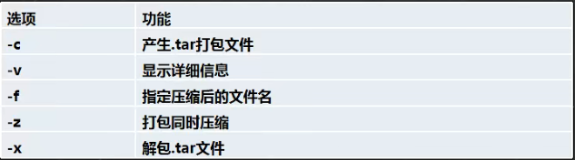

# 压缩和解压

#### 一、压缩和解压类

1. **gzip**/**gunzip**指令：gzip用于压缩文件，gunzip用于解压的。
   - gzip 文件 --压缩文件，只能将文件压缩为*.gz文件
   - gunzip 文件.gz --解压缩文件
   - gzip压缩，将/home/下的hello.txt文件进行压缩 gzip /home/hello.txt
   - gunzip解压缩，将/home下的hello.txt.gz解压。gunzip /home/hello.txt.gz
2. **zip**/**unzip**指令：zip用于压缩文件，unzip用于解压的，这个在项目打包发布中很有用。
   - zip [选项] xxx.zip 将要压缩的内容 ---压缩文件和目录的命令
   - unzip [选项] xxx.zip --解压缩文件
   - -r：递归压缩，即压缩目录  ---zip常用
   - -d<目录>：指定解压后文件的存放目录 --unzip常用
   - 将/home下的所有文件进行压缩成myhome.zip。 zip -r myhome.zip /home/
   - 将myhome.zip解压到/opt/tmp目录下。unzip -d /opt/tmp/ myhome.zip
3. **tar**指令：tar指令是打包指令，最后打包的文件是.tar.gz的文件。
   - tar [选项] XXX.tar.gz 打包的内容 （打包目录，压缩后的文件格式.tar.gz）
   - 
   - 压缩多个文件，将/home/pig.txt和/home/cat.txt压缩成pc.tar.gz。---tar -zcvf pc.tar.gz /home/cat.txt /home/pig.txt
   - 将/home的文件夹压缩成myhome.tar.gz。---tar -zcvf  myhome.tar.gz /home/
   - 将pc.tar.gz解压到当前目录。---tar -zxvf pc.tar.gz
   - 将myhome.tar.gz解压到/opt/tmp2目录下。tar -zxvf pc.tar.gz -C /opt/tmp

