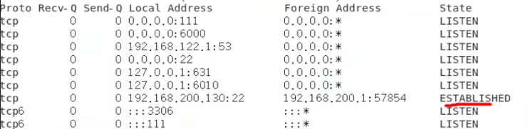

# 统计访问量和连接数


#### 一、分析日志t.log（访问量），将各个ip地址截取，并统计出现次数，并按从大到小的排序。

1. http://192.168.200.10/index1.html

2. http://192.168.200.10/index2.html

3. http://192.168.200.20/index1.html

4. http://192.168.200.30/index1.html

5. http://192.168.200.40/index1.html

6. http://192.168.200.30/order.html

7. http://192.168.200.10/order.html

8. ```shell
   cat t.txt | cut -d '/' -f 3 | sort |uniq -c | sort -nr
   #获取t.txt的内容，然后通过'/'切割内容，我们获取内容的第三部分,然后进行排序再统计，最后再次进行排序,从大到小，不加-nr就是默认从小到大。
   #必须先排序再统计的原因是因为如果相同的ip地址不是顺序排序的，那么就会认为两个相同的ip地址是相互独立的。
   ```

#### 二、统计连接到服务器的各个ip情况，并按连接数从大到小排序

1. 

2. ```shell
   netstat -an | grep ESTABLISHED | awk -F " " '{print $5}' | awk -F ":" '{$1}' | sort | uniq -c | sort -nr 
   #列出网络情况，过滤输出已连接的网络，然后通过awk以空格分割每一条信息，打印分割出来的第五条（ip信息）信息。这里不用cut是因为cut不能以空格作为分隔符。然后再次用awk以冒号为分隔符，将ip信息分割成ip地址和端口号两端，我们获取第一部分，也就是ip地址。最后我们通过sort排序然后uniq来统计最后再用sort来进行排序
   ```
   
   

