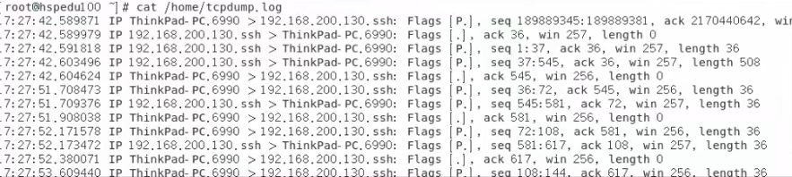

# 访问量排名和tcpdump


#### 一、统计ip访问情况，需要分析nginx访问日志（access.log），找出访问页面数量在前2位的ip

1. ```shell
   cat access.log | awk -F " " '$1' | sort | uniq -c | sort -nr | head -2
   #以空格为分割access.log，输入第一个分割内容，然后排序，然后统计，然后再次排序,获取前两条数据
   ```
   

#### 二、用tcpdump监听本机，将来自ip 192.168.200.1，tcp端口为22的数据，保存输出到tcpdump.log，用做将来数据分析

1. 

2. ```shell
   tcpdump -i ens33 host 192.168,200.1 and port 22 >> /opt/interview/tcpdump.log
   #监视网络设备为ens33，主机号为192.168,200.1，端口号22,的信息监听然后追加到tcpdump.log
   ```

#### 三、常用的nginx模块有哪些，用来做什么

1. rewrite模块，实现重写功能
2. access模块，来源控制
3. ssl模块，安全加密
4. ngx_http_gzip_module：网络传输压缩模块
5. ngx_http_proxy_module：模块实现代理
6. ngx_http_upstream_module：模块实现定义后端服务器列表
7. ngx_cache_purge：实现缓存清除功能

