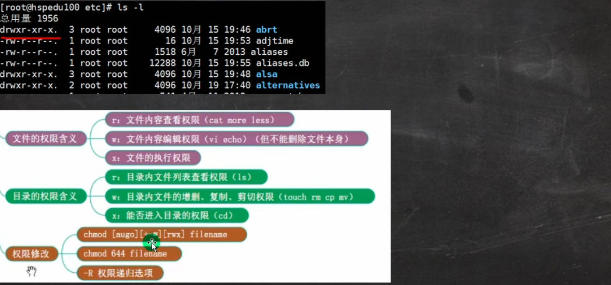
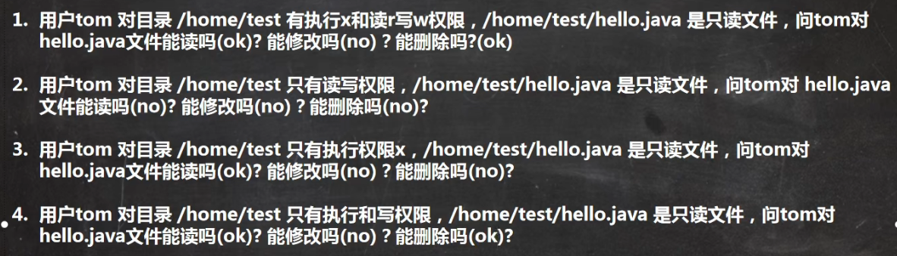

# 系统权限划分

#### 一、身为管理员，在进行linux系统权限划分的时候，应考虑哪些因素？

1. 首先阐述Linux权限的主要对象

   - 

2. 根据实际经验谈考虑因素

   - 注意权限分离，Linux系统权限和数据库权限不要放在同一个部门
   - 权限最小原则，在满足情况的条件下最小优先
   - 减少使用root用户，尽量使用sudo+普通用户执行指令
   - 重要的系统文件，比如/etc/passwd，/etc/shadow etc/fstab，/etc/sudoers等，日常建议使用chatter锁定，需要操作时再打开。
   - 使用SUID,SGID,Sticky，设置特殊权限
   - 可以利用工具比如chkrootkit/rootkit hunter检测rootkit脚本（rootkit是入侵者使用工具，在不察觉的建立入侵系统途径）
   - 利用工具Tripwire检测文件完整性
   - 文件的修改取决于文件是否有w权限，文件的删除取决于所属目录是否有w权限。

3. 

   