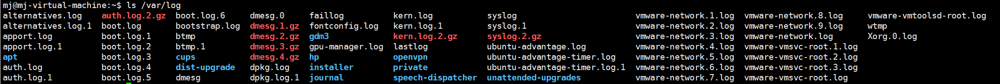
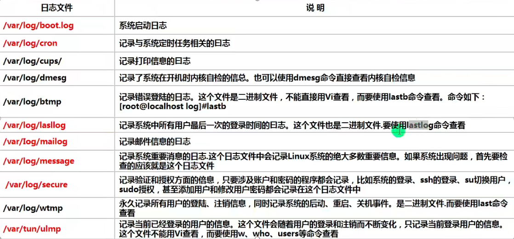
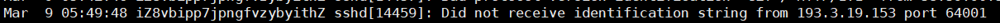

# 日志管理


#### 一、基本介绍

1. 日志文件是重要的系统信息文件，其中记录了许多重要的系统事件，包括用户的登录信息，系统的启动信息，系统的安全信息，邮件相关信息，各种服务相关信息等。
2. 日志对于安全来讲也非常重要，它记录了系统每天发生的各种事情，通过日志来检查错误发生的原因，或者收到攻击时留下的痕迹。
3. 可以这样理解，日志是用来记录重大事件的工具。

#### 二、系统常用的日志

1. /var/log 目录就是系统日志文件的保存位置
   - 
2. 常用日志介绍
   - 

#### 三、日志管理服务 rsyslogd

1. Centos7.6日志服务是rsyslogd，Centos6.x日志服务是syslogd。rsyslogd功能更加强大。rsyslogd的使用，日志文件的格式，和syslogd服务兼容的。

2. 查询Linux中的rsyslogd服务是否启动

   - ps aux | grep "rsyslog" | grep -v "grep"
     - grep -v是反向匹配，要挑选出grep中不包含grep字样的，因为grep中也有"rsyslog"字段，所以要过滤掉grep

3. 查询rsyslogd服务的自启动状态

   - systemctl list-unit-files | grep rsyslog

4. 配置文件：/etc/rsyslog.conf

   - 编辑文件时的格式为： 通配符.通配符  存放日志文件
   - 其中第一个*代表日志类型，第二个通配符代表日志级别
   - 日志类型分为：
     - auth   ##pam产生的日志
     - authpriv  ##ssh，ftp等登录信息的验证信息
     - corn  ##时间任务相关
     - kern  ##内核
     - lpr ##打印
     - mail ##邮件
     - mark（syslog）-rsyslog   ##服务内部的信息，时间标识
     - news  ##新闻信息
     - user  ##用户程序产生的相关信息
     - uucp  ##unix to unix copy 主机之间相关的通信
     - local 1-7  ##自定义的日志设备
   - 日志级别分为：
     - debug  ##有调试信息的，日志通信最多
     - info  ##一般信息日志，最常用
     - notic ## 最具有重要性的普通条件的信息
     - warning ##警告级别
     - err ##错误级别，阻止某个功能或者某个模块不能正常工作的信息
     - crit ##严重级别，阻止整个系统或者整个软件不能正常工作的信息
     - alert ##需要立刻修改的信息
     - emerg ##内核崩溃等重要信息
     - none ##什么都不记录
     - 注意从下到下，级别从低到高，记录的信息越少

5. 有日志服务rsyslogd记录的日志文件，日志文件的格式包含以下4列：

   - 事件产生的时间
   - 产生事件的服务器的主机名
   - 产生事件的服务器或程序名
   - 事件的具体信息

6. 日志查看实例

   - 查看以下/var/log/secure日志，这个日志中记录的是用户验证和授权方面的信息，来分析如何查看
     - 
     - 时间，产生时间的主机名，产生时间的程序名sshd，时间信息：没有收到从193.3.19.53的端口64001传来的可识别字符串。--指令打错了被记录了下来。

7. 自定义日志服务

   - 在/etc/rsyslog.conf中添加一个日志文件/var/log/mj.log，当有事件发送的时（比如sshd服务相关事件），该文件会接受到信息并保存。

   - ```
     vim /etc/rsyslog.conf
     在其中添加
     #增加自定义的日志,所有类型，所有级别的操作都放到这个日志中
     *.*				/var/log/mj.log
     ```

