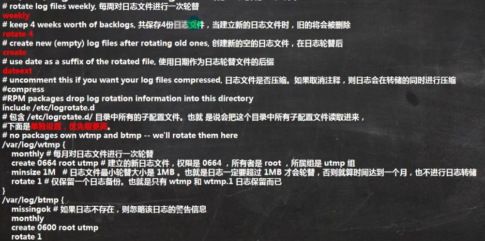
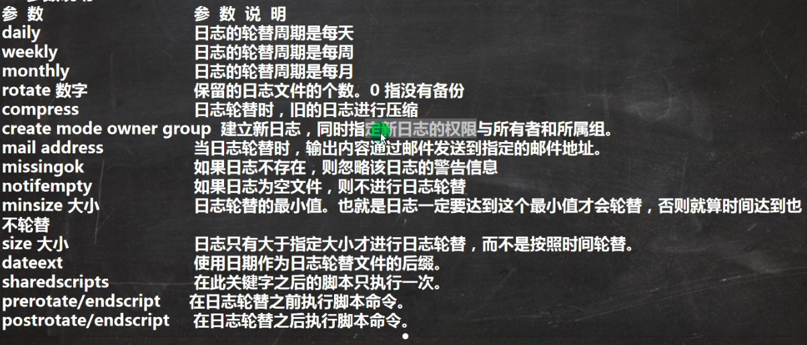

# 日志轮替

#### 一、基本介绍

1. 日志轮替就是把旧的日志文件移动并改名，同时建立新的空日志文件，当旧日志文件超出保存的范围之后，就会进行删除

#### 二、日志轮替文件命名

1. centos7使用logrotate进行日志轮替管理，想要改变日志轮替文件名字，通过/etc/logrotate.conf配置文件中"dateext"参数。
2. 如果配置文件中有“dateext”参数，那么日志会用日期来作为日志文件的后缀，例如“secure-20201010”。这样日志文件名不会重叠，也就不需要日志文件的改名，只需要指定保存日志的个数，删除多余的日志文件即可。
3. 如果配置文件中没有“dateext”参数，日志文件就需要进行改名了，当第一次进行日志轮替时，当前的“secure”日志会自动改名为“secure.1”，然后新建secure日志，当第二次进行日志轮替时，“secure.1”会自动改名为"secure.2"，当前的“secure”日志会自动改名为“secure.1”，然后也会新建立“secure”日志，用来保存新的日志，以此类推。

#### 三、logrotate配置文件

1. /etc/logrotate.conf为logrotate的全局配置文件
   - 
2. 参数说明
   - 
3. 把自己的日志加入到日志轮替中：
   - 第一种方法是直接在/etc/logrotate.conf配置文件中写入该日志的轮替策略。
   - 第二种方法是在/etc/logrotate.d/目录中新建该日志的轮替文件。在该轮替文件中写入正确的轮替策略，因为该目录中的文件都会被“include”到主配置文件中。所以也可以把日志加入轮替。
   - 推荐使用第二种方法，有利于文件的管理和维护。
4. 日志轮替机制原理
   - 日志轮替之所以可以在指定的时间备份日志，是依赖系统定时任务，在/etc/cron.daily/目录，就会发现这个目录中是有logrotate文件（可执行），logrotate通过这个文件依赖定时任务执行的。

#### 四、内存日志

1. journalctl 可以查看日志内容，这里我们看看常用的指令
   - journalctl ##查看全部
   - journalctl -n 3 ##查看最新三条
   - journalctl --since 19:00 --until 19:10:10  #查看起始时间到结束时间的日志可加日期
   - journalctl -p err #报错日志
   - journalctl -o verbose #日志详细内容
   - journalctl _PID=1245 _COMM=sshd  #查看包含这些参数的日志（在详细日志查看）或者journalctl | grep sshd
   - 注意：journalctl查看的是内存日志，重启清空。 