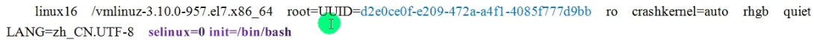
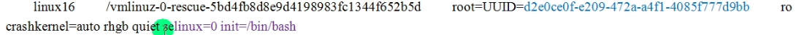

# 定制自己的linux系统

#### 一、基本介绍

1. 通过裁剪一个大的linux系统，搭建一个小的定制linux系统

#### 二、基本原理

1. 启动流程介绍：
   - 首先Linux要通过自检，检查硬件设备有没有故障。
   - 如果有多块启动盘的话，需要在BIOS中选择启动盘。
   - 启动MBR中的bootloader引导程序
   - 加载内核文件
   - 执行所有进程的父进程，老祖宗systemd
   - 欢迎界面
2. 在linux的启动流程中，加载内核文件时关键文件：
   - kernel文件：vmlinuz-3.10.0-957.el7.x86_64
   - initrd文件：initramfs-3.10.0-957.el7.x86_64.img

#### 三、制作min Linux思路分析

1. 在现有的linux系统（Centos7.6）上加一块硬盘/dev/sdb，在硬盘上分两个分区，一个是/boot，一个是/，并将其格式化。需要明确的是，现在加的这个硬盘在现有的linux系统中是/dev/sdb，但是，当我们把东西全部设置好时，要把这个硬盘拔除，放在新系统上，此时，就是/dev/sda。
2. 在/dev/sdb硬盘上，将其打造成独立的linux系统，里面的所有文件是需要拷贝进去的。
3. 作为能独立运行的linux系统，内核是一定不能少，要把内核文件和initramfs文件一起拷贝到/dev/sdb上
4. 以上步骤完成，我们自制的linux系统就完成，创建一个新的linux虚拟机，将其硬盘指向我们创建的硬盘，启动即可

#### 四、步骤

1. 在原本的虚拟机中添加新的硬盘块，需要注意的是，在选择将磁盘存储为单个还是多个文件文件时，选择单个文件，因为我们要将这个硬盘作为引导盘。然后，点击完成，开机。
2. 然后通过fdisk来给我们的/dev/sdb分区
   - fdisk /dev/sdb
   - n
   - /boot区给500M   （+500M）
   - n
   - 一直回车，将剩余容量全给这个分区sdb2
   - w
3. 对/dev/sdb的分区进行格式化
   - mkfs.ext4 /dev/sdb1
   - mkfs.ext4 /dev/sdb2
4. 创建目录，并挂载新的分区
   - mkdir -p /mnt/boot /mnt/sysroot
   - mount /dev/sdb1 /mnt/boot
   - mount /dev/sdb2 /mnt/sysroot
5. 安装grub，内核文件拷贝至目标磁盘
   - grub2-install --root-directory=/mnt /dev/sdb
   - hexdump -C -n 512 /dev/sdb (看一下二进制来确认我们是否安装成功)
   - rm -rf /mnt/boot/*
   - cp -rf /boot/* /mnt/boot/
6. 修改grub2/grub.cfg文件，标红的部分是需要使用指令来查看的
   - 修改引导盘的uuid和root盘的uuid
   - 同时需要在两个位置加上两条语句
   - 
   - 
7. 创建目标主机根文件系统
   - mkdir -pv /mnt/sysroot/{etc/rc.d,usr,var,proc,sys,dev,lib,lib64,bin,sbin,boot,srv,mnt,media,home,root}
8. 拷贝需要的bash（也可以拷贝你需要的指令）和库文件给新的系统使用
   - cp /lib64/*.通配符 /mnt/sysroot/lib64/
   - cp /bin/bash /mnt/sysroot/bin/
9. 现在我们就可以创建一个新的虚拟机，然后默认分配的硬盘移除掉，执行我们刚刚创建的磁盘即可