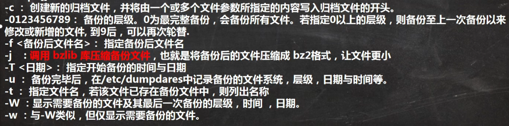
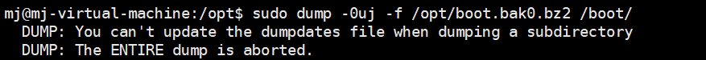
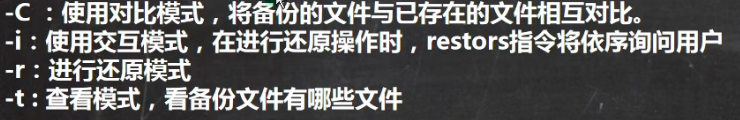

# 备份与恢复


#### 一、基本介绍

1. 把需要的文件（或者分区）用TAR打包就行，下次需要恢复的时候，在解压覆盖
2. 使用dump和restore命令
3. 安装dump和restore
   - yum -y install dump
   - yum -y install restore

#### 二、使用dump完成增量备份

1. dump支持分卷和增量备份（所谓增量备份是指备份上次备份后修改/增加过的文件，也称差异备份）

2. 基础语法

   - dump [ -cu] [-123456789] [ -f <备份后文件名> ] [-T <日期>] [目录或文件系统]
   - dump []-wW
   - 

3. 案例

   - 将/boot目录中所有内容备份到/opt/boot.bak.bz2 文件中，备份层级为0

     - ```
       dump -0uj -f /opt/boot.bak.bz0 /boot
       ```

   - 如果出现以下报错

     - 
     - 当备份为一个独立的文件系统(独立的分区)时，可以使用-u，如果只是备份目录下的文件时，不能使用-u

   - 在/boot目录下拷贝一个文件，备份层级“1“（只备份上次使用层次”0“备份后发生过改变的数据），注意比较看这次生成的文件备份文件boot1.bak有多大。

     - ```
       dump -1uj -f /opt/boot.bak1.bz2 /boot
       ```

   - 通过dump命令配合crontab可以实现无人值守备份。

#### 三、数据恢复restore

1. restore命令用来恢复已备份的文件，可以从dump生成的备份文件中恢复原文件

2. 基本语法：

   - restore [模式选项] [选项]
   - 四个模式
     - 
   - 选项
     - -f <备份设备>：从指定的文件中读取备份数据，进行还原操作。

3. 案例

   - restore命令比较模式，比较备份文件和原文件的区别

     - ```
       mv /boot/hello.java /boot/hello100.java
       restore -C -f boot.bak1.bz2 //比较最新备份文件和当前原文件比较
       ```

   - restore命令还原模式，注意细节：如果你有增量备份，需要把增量备份文件也进行恢复，有几个增量备份文件，就要恢复几个，按顺序来恢复即可。

     - ```
       mkdir /opt/boottmp
       cd /opt/boottmp
       restore -r -f /opt/boot.bak0.bz2//恢复到第1次完全备份的状态
       restore -r -f /opt/boot.bak1.bz2//恢复到第2次增量备份的状态
       ```

       